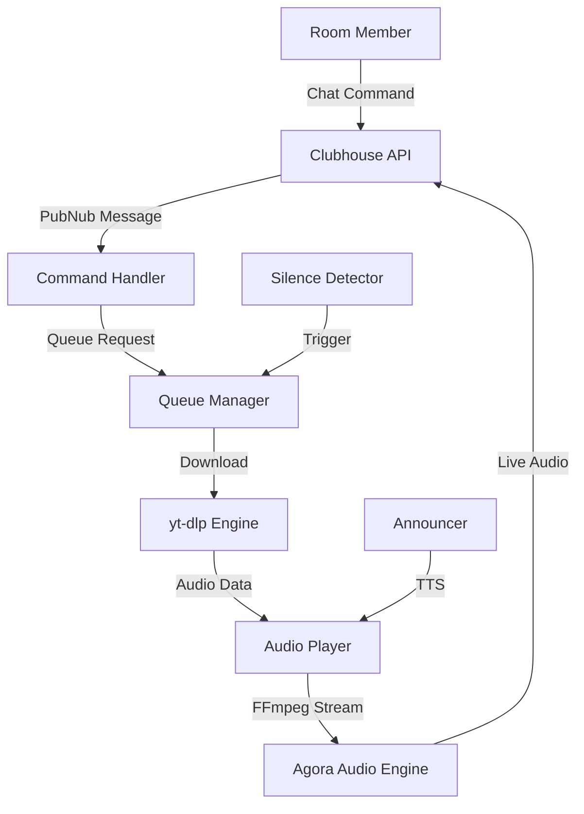

# <a name="header"></a>ClubDJ — Your Room's Personal Clubhouse DJ

[](https://opensource.org/licenses/MIT)
[](https://www.python.org/downloads/)
[-green.svg)](docs/DEPLOY_MOBILE.md)
[](docs/DEPLOY_RENDER.md)

Non-stop beats, smooth transitions, and instant song requests—no awkward silence, just pure vibe. Plug in, chill, and let the bot run the party.

[Demo](#usage) • [Documentation](#getting-started) • [Report Bug](https://github.com/vincenzo-afk/clubhouse-dj/issues) • [Request Feature](https://github.com/vincenzo-afk/clubhouse-dj/issues)

---

## <a name="toc"></a>Table of Contents

1. [About the Project](#about)
2. [Tech Stack](#tech-stack)
3. [Getting Started](#getting-started)
4. [Usage](#usage)
5. [Project Structure](#structure)
6. [Features & Roadmap](#features)
7. [Testing](#testing)
8. [Deployment](#deployment)
9. [Contributing](#contributing)
10. [Security](#security)
11. [License](#license)
12. [Acknowledgments](#acknowledgments)

---

## <a name="about"></a>## About the Project

ClubDJ is a production-grade music bot designed specifically for Clubhouse rooms. It solves the problem of "dead air" and manual DJing by providing an automated, request-driven audio pipeline. Whether you're running a 24/7 lofi room or a live talk show, ClubDJ handles the audio so you can focus on the conversation.

### Key Features

*   **🎙️ Chat-Driven DJ:** Users can request songs directly in the room chat using `!play`.
*   **🤖 Auto DJ Fallback:** Automatically plays from a curated playlist when the queue is empty or the room goes silent.
*   **🔊 Professional Audio Pipeline:** Uses `yt-dlp` and `ffmpeg` for high-quality audio processing and streaming.
*   **🗣️ TTS Announcements:** Built-in Text-to-Speech announces new tracks and queue updates.
*   **⚖️ Democratic Skip System:** 3-vote skip system for the audience, with instant overrides for moderators.
*   **📱 Mobile-Ready:** Fully optimized to run on Android via Termux for free, portable hosting.
*   **☁️ Cloud Native:** One-click deployment to Render with built-in health checks.

### Architecture Overview



---

## <a name="tech-stack"></a>## Tech Stack

| Category | Technology |
|---|---|
| **Language** | Python 3.10+ |
| **Clubhouse Integration** | `clubhouse-py`, PubNub SDK |
| **Audio Processing** | `ffmpeg`, `yt-dlp`, `pydub` |
| **Streaming** | Agora Audio SDK (via clubhouse-py) |
| **TTS** | `gTTS`, `pyttsx3` |
| **Scheduling** | `APScheduler` |
| **Hosting** | Render, Termux (Android), systemd (Linux) |

---

## <a name="getting-started"></a>## Getting Started

### Prerequisites

*   **Python 3.10+**
*   **FFmpeg** (installed on your system)
*   **Clubhouse Account** (Google sign-in recommended for bot accounts)

### Installation

#### Local Development (Linux/macOS)

```bash
# 1. Clone the repository
git clone https://github.com/vincenzo-afk/clubhouse-dj.git
cd clubhouse-dj

# 2. Run the universal installer
chmod +x install.sh
./install.sh

# 3. Configure your account
nano config.json
```

#### Android (Termux)

```bash
# 1. Setup Termux storage and install git
termux-setup-storage
pkg install -y git

# 2. Clone and run mobile installer
git clone https://github.com/vincenzo-afk/clubhouse-dj.git
cd clubhouse-dj
chmod +x install_termux.sh
./install_termux.sh
```

### Configuration

The `config.json` file controls all bot behavior:

```json
{
  "phone_number": "+91...",      // Your bot account number
  "room_id": "channel_id",       // The Clubhouse room ID
  "silence_threshold_minutes": 10,
  "auto_dj_mode": true,
  "announce_songs": true,
  "skip_votes_required": 3
}
```

---

## <a name="usage"></a>## Usage

### Authentication

Clubhouse uses a token-based system. Because SMS OTP delivery can be unreliable in some regions, we recommend Method 2:

1.  **Log into the Clubhouse app** on your phone using **Google sign-in**.
2.  **Capture your token** using a tool like *Packet Capture* (Android) or browser DevTools (Web).
3.  Copy the `CH-Auth` header value and save it to `auth_token.json`.

### Running the Bot

**Standard Run:**
```bash
python3 main.py
```

**Background (systemd):**
```bash
sudo systemctl start clubdj
```

**Demo Mode (Local test without account):**
```bash
python3 main.py --demo
```

### Chat Commands

| Command | Description |
|---|---|
| `!play <song>` | Search and queue a song |
| `!skip` | Vote to skip the current track |
| `!queue` | View the current song list |
| `!np` | Show "Now Playing" information |
| `!help` | List all available commands |

---

## <a name="structure"></a>## Project Structure

```text
.
├── bot/                   # Core logic modules
│   ├── clubhouse_client.py # API & PubNub integration
│   ├── audio_player.py     # Download & Stream engine
│   ├── queue_manager.py    # Playlist & Auto DJ logic
│   └── announcer.py        # TTS implementation
├── docs/                  # Platform-specific guides
├── playlist/              # Default tracks & caches
├── tests/                 # Unit & E2E test suites
├── main.py                # Entry point
├── auth_setup.py          # Auth helper script
├── install.sh             # Linux/macOS installer
└── install_termux.sh      # Android/Termux installer
```

---

## <a name="features"></a>## Features & Roadmap

### Current Features
- [x] Full Clubhouse API integration
- [x] Real-time chat command parsing
- [x] High-performance audio streaming
- [x] Multi-platform hosting (Cloud/Mobile/PC)
- [x] Automatic silence recovery

### Roadmap
- [ ] Spotify/Apple Music playlist sync
- [ ] Web dashboard for queue management
- [ ] Multi-room support from a single instance
- [ ] Advanced audio filters (Equalizer)

---

## <a name="testing"></a>## Testing

ClubDJ includes a comprehensive test suite covering all core components.

```bash
# Run all unit tests
python3 -m unittest discover tests

# Run end-to-end demo test
python3 tests/test_e2e_demo.py
```

---

## <a name="deployment"></a>## Deployment

### Render (Cloud)
1.  Connect your GitHub repo to Render.
2.  Use the `render.yaml` blueprint.
3.  Set environment variables: `USER_ID`, `USER_TOKEN`, `DEVICE_ID`.
4.  See [docs/DEPLOY_RENDER.md](docs/DEPLOY_RENDER.md) for details.

### Self-Hosting (Linux)
Use the provided `systemd/clubdj.service` for production-grade persistence.
```bash
sudo cp systemd/clubdj.service /etc/systemd/system/
sudo systemctl enable clubdj
sudo systemctl start clubdj
```

---

## <a name="contributing"></a>## Contributing

Contributions are welcome! Please follow these steps:
1.  Fork the Project.
2.  Create your Feature Branch (`git checkout -b feature/AmazingFeature`).
3.  Commit your Changes (`git commit -m 'Add some AmazingFeature'`).
4.  Push to the Branch (`git push origin feature/AmazingFeature`).
5.  Open a Pull Request.

---

## <a name="security"></a>## Security

Please do not share your `auth_token.json` or environment variables. If you suspect your token has been compromised, log out of the Clubhouse app to invalidate the session.

---

## <a name="license"></a>## License

Distributed under the MIT License. See `LICENSE` for more information.

---

## <a name="acknowledgments"></a>## Acknowledgments

*   [clubhouse-py](https://github.com/stypr/clubhouse-py) for the API foundation.
*   [yt-dlp](https://github.com/yt-dlp/yt-dlp) for the audio engine.
*   [Agora.io](https://www.agora.io/) for the streaming infrastructure.

---

<p align="center">Built with ❤️ by <a href="https://github.com/vincenzo-afk">vincenzo-afk</a></p>

[Back to Top](#header)
